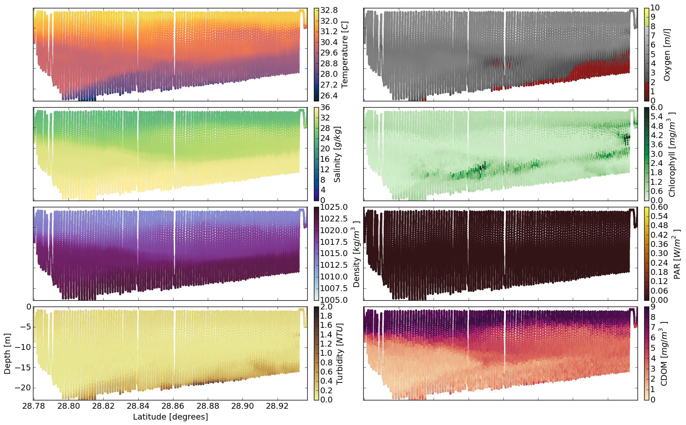
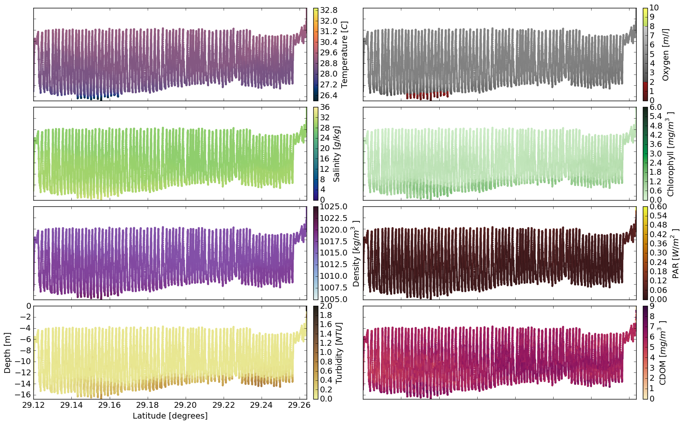
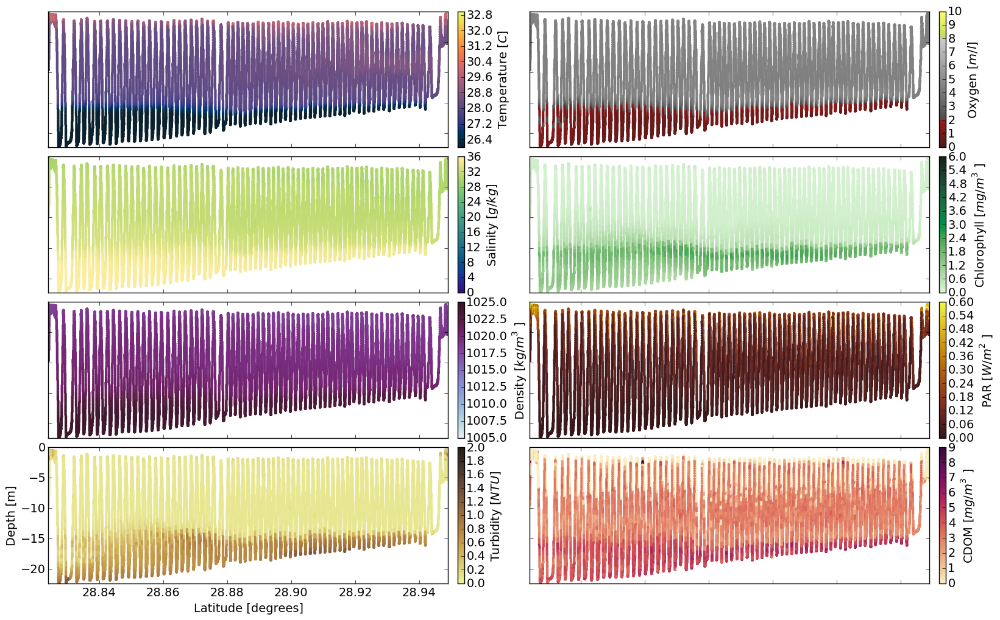
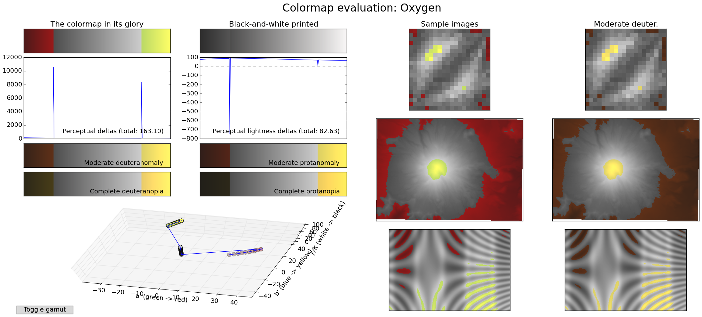
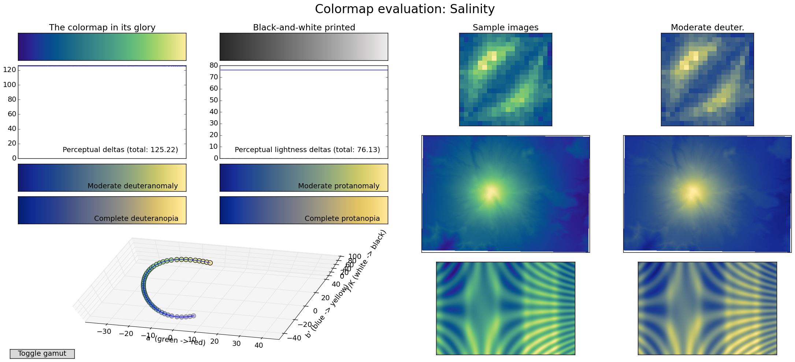
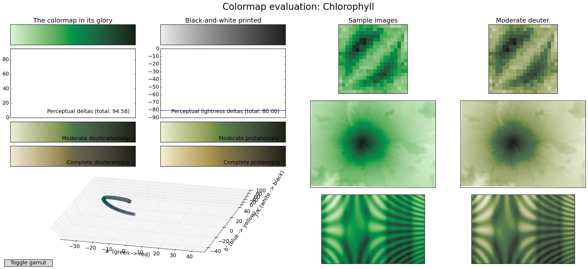
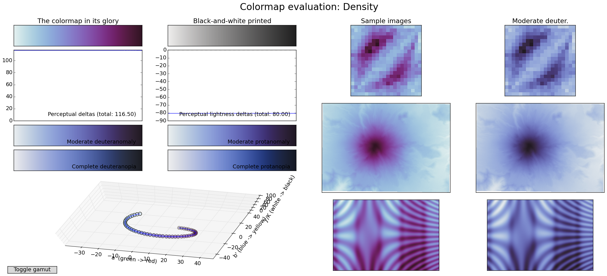
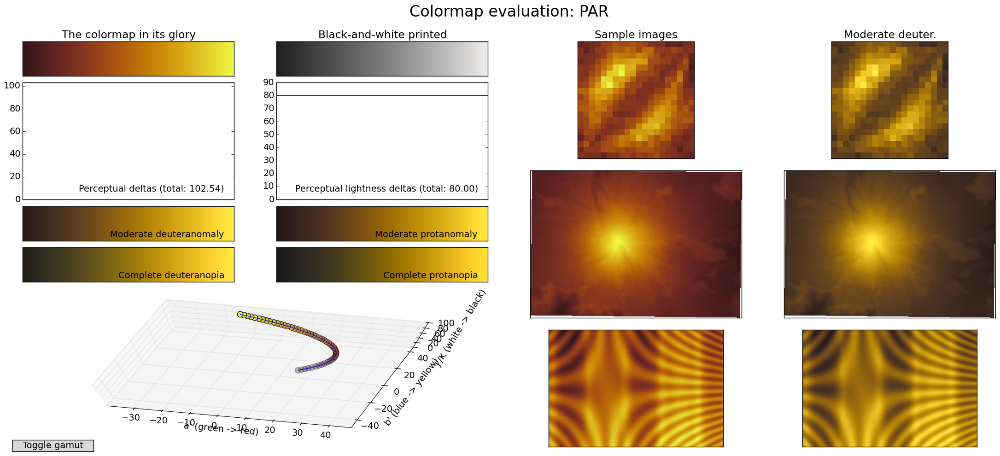
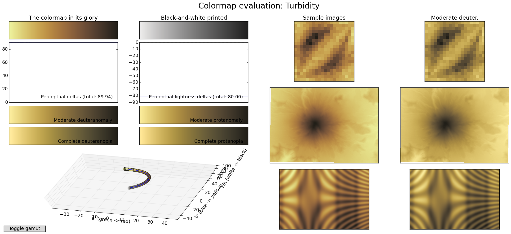
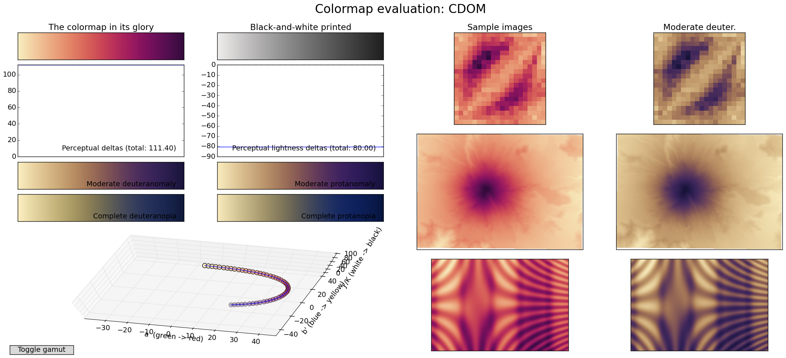

cmtamu
======

Colormap setup for standardizing commonly-plotting oceanographic variables, especially at Texas A&M. Most of the colormaps are straight from [matplotlib](http://matplotlib.org/).

Here is our gallery: 

Lightness plots of the colormaps: 

Sample data plots of the colormaps: 

Evaluations of the perceptual accuracy of the colormaps (see http://bids.github.io/colormap/): 

## To use:

* `git clone git@github.com:kthyng/cmtamu.git`
* `pip install -e .` in the cloned directory to install a link to this package to where your site packages are stored. You might need to figure out permissions or prefixes, etc.
* Now you can import the package from wherever and use the awesome colormaps! That is, `from cmtamu import cmtamu' and get your salinity colormap instance with `cmap = cmtamu.salinity`. 

## Functions available:

### test:
* Generate a colormap that is linearly interpolated between input rgb or hex colors.
* Check the lightness values of a colormap.
* Read in a sample data set to then plot the data with grayscale, jet, and the same colormap.

### tools:
* Plot lightness of colormaps.
* Print the rgb of the colormaps to text files.
* Plot sample data up with colormaps.
* Plot a matplotlib-style gallery of the colormaps, including the grayscale equivalent.

### cmtamu:
* Functions that specify colormaps for each of eight oceanographic fields: salinity, temperature, density, PAR, oxygen, CDOM, chlorophyll, and turbidity.
* Can be imported and used directly to access colormaps by property.
